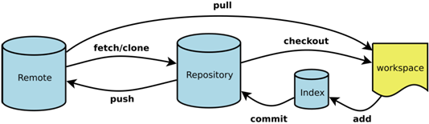

[git基本操作，一篇文章就够了！](https://juejin.im/post/5ae072906fb9a07a9e4ce596)

git的通用操作流程如下图（来源于网络）


#### 主要涉及到四个关键点：

1. 工作区：本地电脑存放项目文件的地方，比如learnGitProject文件夹；

2. 暂存区（Index/Stage）：在使用git管理项目文件的时候，其本地的项目文件会多出一个.git的文件夹，将这个.git文件夹称之为版本库。其中.git文件夹中包含了两个部分，一个是暂存区（Index或者Stage）,顾名思义就是暂时存放文件的地方，通常使用add命令将工作区的文件添加到暂存区里；

3. 本地仓库：.git文件夹里还包括git自动创建的master分支，并且将HEAD指针指向master分支。使用commit命令可以将暂存区中的文件添加到本地仓库中；

   在`Git/RybyDemo/grit/.git/refs/heads` 目录中修改master:

   ```
   ebdec5ff037c7368b2b1827fadc66741d1ed14ed
   ```

   修改`HEAD`:

   ```
   ref:refs/heads/master
   ```

1. 远程仓库：不是在本地仓库中，项目代码在远程git服务器上，比如项目放在github上，就是一个远程仓库，通常使用clone命令将远程仓库拷贝到本地仓库中，开发后推送到远程仓库中即可；

更细节的来看：


日常开发时代码实际上放置在工作区中，也就是本地的XXX.java这些文件，通过add等这些命令将代码文教提交给暂存区（Index/Stage），也就意味着代码全权交给了git进行管理，之后通过commit等命令将暂存区提交给master分支上，也就是意味打了一个版本，也可以说代码提交到了本地仓库中。另外，团队协作过程中自然而然还涉及到与远程仓库的交互。

因此，经过这样的分析，git命令可以分为这样的逻辑进行理解和记忆：

1. git管理配置的命令；

   **几个核心存储区的交互命令：**

2. 工作区与暂存区的交互；

3. 暂存区与本地仓库（分支）上的交互；

4. 本地仓库与远程仓库的交互。

#### 2. git配置命令

查询配置信息

1. 列出当前配置：`gitconfig     --list`;
2. 列出repository配置：`gitconfig --local     --list`;
3. 列出全局配置：`gitconfig     --global --list`;
4. 列出系统配置：`gitconfig     --system --list`;

第一次使用git，配置用户信息

1. 配置用户名：`gitconfig     --global user.name "your name"`;
2. 配置用户邮箱：`gitconfig     --global user.email "youremail@github.com"`;

其他配置

1. 配置解决冲突时使用哪种差异分析工具，比如要使用vimdiff：`gitconfig --global     merge.toolvimdiff`;
2. 配置git命令输出为彩色的：`gitconfig     --global color.ui auto`;
3. 配置git使用的文本编辑器：`gitconfig     --global core.editor vi`;

#### 3. 工作区上的操作命令

新建仓库

1. 将工作区中的项目文件使用git进行管理，即创建一个新的本地仓库：`gitinit`；
2. 从远程git仓库复制项目：`git clone     <url>`，如：git clone git://github.com/wasd/example.git;克隆项目时如果想定义新的项目名，可以在clone命令后指定新的项目名：`git clone     git://github.com/wasd/example.git mygit`；

提交

1. 提交工作区所有文件到暂存区：`git     add .`
2. 提交工作区中指定文件到暂存区：`git     add <file1><file2> ...`;
3. 提交工作区中某个文件夹中所有文件到暂存区：`git     add [dir]`;

撤销

1. 删除工作区文件，并且也从暂存区删除对应文件的记录：`gitrm<file1><file2>`;
2. 从暂存区中删除文件，但是工作区依然还有该文件:`gitrm --cached <file>`;
3. 取消暂存区已经暂存的文件：`git     reset HEAD <file>...`;
4. 撤销上一次对文件的操作：`git     checkout --<file>`。要确定上一次对文件的修改不再需要，如果想保留上一次的修改以备以后继续工作，可以使用stashing和分支来处理；
5. 隐藏当前变更，以便能够切换分支：`git     stash`；
6. 查看当前所有的储藏：`git     stash list`；
7. 应用最新的储藏：`git     stash apply`，如果想应用更早的储藏：`git     stash apply stash@{2}`；重新应用被暂存的变更，需要加上`--index`参数：`git stash apply     --index`;
8. 使用apply命令只是应用储藏，而内容仍然还在栈上，需要移除指定的储藏：`git     stash drop stash{0}`；如果使用pop命令不仅可以重新应用储藏，还可以立刻从堆栈中清除：`git     stash pop`;
9. 在某些情况下，你可能想应用储藏的修改，在进行了一些其他的修改后，又要取消之前所应用储藏的修改。Git没有提供类似于 stash unapply 的命令，但是可以通过取消该储藏的补丁达到同样的效果：`git     stash show -p stash@{0} | git apply -R`；同样的，如果你沒有指定具体的某个储藏，Git 会选择最近的储藏：`git stash show -p     | git apply -R`；

更新文件

1. 重命名文件，并将已改名文件提交到暂存区：`git mv     [file-original] [file-renamed]`;

查新信息

1. 查询当前工作区所有文件的状态：`git     status`;
2. 比较工作区中当前文件和暂存区之间的差异，也就是修改之后还没有暂存的内容：git diff；指定文件在工作区和暂存区上差异比较：`git     diff <file-name>`;

#### 4. 暂存区上的操作命令

提交文件到版本库

1. 将暂存区中的文件提交到本地仓库中，即打上新版本：`git     commit -m "commit_info"`;
2. 将所有已经使用git管理过的文件暂存后一并提交，跳过add到暂存区的过程：`git     commit -a -m "commit_info"`;
3. 提交文件时，发现漏掉几个文件，或者注释写错了，可以撤销上一次提交：`git     commit --amend`;

查看信息

1. 比较暂存区与上一版本的差异：`git     diff --cached`;
2. 指定文件在暂存区和本地仓库的不同：`git     diff <file-name> --cached`;
3. 查看提交历史：git log；参数`-p`展开每次提交的内容差异，用`-2`显示最近的两次更新，如`git     log -p -2`;

打标签

Git 使用的标签有两种类型：**轻量级的（lightweight）和含附注的（annotated）**。轻量级标签就像是个不会变化的分支，实际上它就是个指向特定提交对象的引用。而含附注标签，实际上是存储在仓库中的一个独立对象，它有自身的校验和信息，包含着标签的名字，电子邮件地址和日期，以及标签说明，标签本身也允许使用 GNU Privacy Guard (GPG) 来签署或验证。一般我们都建议使用含附注型的标签，以便保留相关信息；当然，如果只是临时性加注标签，或者不需要旁注额外信息，用轻量级标签也没问题。

1. 列出现在所有的标签：`git     tag`;
2. 使用特定的搜索模式列出符合条件的标签，例如只对1.4.2系列的版本感兴趣：`git tag -l     "v1.4.2.*"`;
3. 创建一个含附注类型的标签，需要加`-a`参数，如`git tag -a v1.4     -m "my version 1.4"`;
4. 使用git show命令查看相应标签的版本信息，并连同显示打标签时的提交对象：`git     show v1.4`;
5. 如果有自己的私钥，可以使用GPG来签署标签，只需要在命令中使用`-s`参数：`git tag -s v1.5     -m "my signed 1.5 tag"`;
6. 验证已签署的标签：git tag -v ，如`git tag -v v1.5`;
7. 创建一个轻量级标签的话，就直接使用git tag命令即可，连`-a`,`-s`以及`-m`选项都不需要，直接给出标签名字即可，如`git     tag v1.5`;
8. 将标签推送到远程仓库中：git push origin ，如`git push origin     v1.5`；
9. 将本地所有的标签全部推送到远程仓库中：`git     push origin --tags`;

分支管理

1. 创建分支：`git     branch <branch-name>`，如`git     branch testing`；
2. 从当前所处的分支切换到其他分支：`git     checkout <branch-name>`，如`git     checkout testing`；
3. 新建并切换到新建分支上：`git     checkout -b <branch-name>`;
4. 删除分支：`git     branch -d <branch-name>`；
5. 将当前分支与指定分支进行合并：`git     merge <branch-name>`;
6. 显示本地仓库的所有分支：`git     branch`;
7. 查看各个分支最后一个提交对象的信息：`git     branch -v`;
8. 查看哪些分支已经合并到当前分支：`git     branch --merged`;
9. 查看当前哪些分支还没有合并到当前分支：`git     branch --no-merged`;
10. 把远程分支合并到当前分支：`git     merge <remote-name>/<branch-name>`，如`git merge     origin/serverfix`；如果是单线的历史分支不存在任何需要解决的分歧，只是简单的将HEAD指针前移，所以这种合并过程可以称为快进（Fast forward），而如果是历史分支是分叉的，会以当前分叉的两个分支作为两个祖先，创建新的提交对象；如果在合并分支时，遇到合并冲突需要人工解决后，再才能提交；
11. 在远程分支的基础上创建新的本地分支`：git checkout -b     <branch-name><remote-name>/<branch-name>`，如`git checkout -b     serverfix origin/serverfix`;
12. 从远程分支checkout出来的本地分支，称之为跟踪分支。在跟踪分支上向远程分支上推送内容：`git     push`。该命令会自动判断应该向远程仓库中的哪个分支推送数据；在跟踪分支上合并远程分支：`git     pull`；
13. 将一个分支里提交的改变移到基底分支上重放一遍：`git     rebase <rebase-branch><branch-name>`，如`git rebase master     server`，将特性分支server提交的改变在基底分支master上重演一遍；使用rebase操作最大的好处是像在单个分支上操作的，提交的修改历史也是一根线；如果想把基于一个特性分支上的另一个特性分支变基到其他分支上，可以使用`--onto`操作：`git rebase --onto     <rebase-branch><feature branch><sub-feature-branch>`，如`git rebase --onto     master server client`；使用rebase操作应该遵循的原则是：**一旦分支中的提交对象发布到公共仓库，就千万不要对该分支进行rebase操作**；

#### 5.本地仓库上的操作

1. 查看本地仓库关联的远程仓库：`git     remote`；在克隆完每个远程仓库后，远程仓库默认为`origin`;加上`-v`的参数后，会显示远程仓库的`url`地址；
2. 添加远程仓库，一般会取一个简短的别名：`git     remote add [remote-name] [url]`，比如：`git remote     add example git://github.com/example/example.git`;
3. 从远程仓库中抓取本地仓库中没有的更新：`git     fetch [remote-name]`，如`git     fetch origin`;使用fetch只是将远端数据拉到本地仓库，并不自动合并到当前工作分支，只能人工合并。如果设置了某个分支关联到远程仓库的某个分支的话，可以使用`git     pull`来拉去远程分支的数据，然后将远端分支自动合并到本地仓库中的当前分支；
4. 将本地仓库某分支推送到远程仓库上：`git     push [remote-name] [branch-name]`，如`git push origin master`；如果想将本地分支推送到远程仓库的不同名分支：`git     push <remote-name><local-branch>:<remote-branch>`，如`git push origin     serverfix:awesomebranch`;如果想删除远程分支：`git     push [romote-name] :<remote-branch>`，如`git push origin     :serverfix`。这里省略了本地分支，也就相当于将空白内容推送给远程分支，就等于删掉了远程分支。
5. 查看远程仓库的详细信息：`git     remote show origin`；
6. 修改某个远程仓库在本地的简称：`git     remote rename [old-name] [new-name]`，如`git remote rename origin org`；
7. 移除远程仓库：`git     remote rm [remote-name]`；

#### 6. 忽略文件.gitignore

一般我们总会有些文件无需纳入 Git 的管理，也不希望它们总出现在未跟踪文件列表。通常都是些自动生成的文件，比如日志文件，或者编译过程中创建的临时文件等。我们可以创建一个名为 .gitignore 的文件，列出要忽略的文件模式。如下例：

```
# 此为注释 – 将被 Git 忽略
# 忽略所有 .a 结尾的文件
*.a
# 但 lib.a 除外
!lib.a
# 仅仅忽略项目根目录下的 TODO 文件，不包括 subdir/TODO
/TODO
# 忽略 build/ 目录下的所有文件
build/
# 会忽略 doc/notes.txt 但不包括 doc/server/arch.txt
doc/*.txt
# 忽略 doc/ 目录下所有扩展名为 txt 的文件
doc/**/*.txt
复制代码
```

参考资料

[非常详细准确的git学习资料]()；

[git-cheat-sheet中文版]()

[命令总结，资料一般，不够详细，作参考]()

[常用命令很全]()


 作者：你听___
 链接：https://juejin.im/post/5ae072906fb9a07a9e4ce596
 来源：掘金
 著作权归作者所有。商业转载请联系作者获得授权，非商业转载请注明出处。

 

阮一峰网络日志：http://www.ruanyifeng.com/blog/2015/12/git-cheat-sheet.html

### 1.常用 Git 命令清单

我每天使用 Git ，但是很多命令记不住。

一般来说，日常使用只要记住下图6个命令，就可以了。但是熟练使用，恐怕要记住60～100个命令。



下面是我整理的常用 Git 命令清单。几个专用名词的译名如下。

§ Workspace：工作区

§ Index / Stage：暂存区

§ Repository：仓库区（或本地仓库）

§ Remote：远程仓库

#### 一、新建代码库

```
 
# 在当前目录新建一个Git代码库
$ gitinit
 
# 新建一个目录，将其初始化为Git代码库
$ gitinit[project-name]
 
# 下载一个项目和它的整个代码历史
$ git clone [url]
 
```

#### 二、配置

Git的设置文件为`.gitconfig`，它可以在用户主目录下（全局配置），也可以在项目目录下（项目配置）。

```
 
# 显示当前的Git配置
$ gitconfig--list
 
# 编辑Git配置文件
$ gitconfig-e [--global]
 
# 设置提交代码时的用户信息
$ gitconfig[--global] user.name "[name]"
$ gitconfig[--global]user.email"[email address]"
```

#### 三、增加/删除文件

```
 
# 添加指定文件到暂存区
$ git add [file1][file2]...
 
# 添加指定目录到暂存区，包括子目录
$ git add [dir]
 
# 添加当前目录的所有文件到暂存区
$ git add .
 
# 添加每个变化前，都会要求确认
# 对于同一个文件的多处变化，可以实现分次提交
$ git add -p
 
# 删除工作区文件，并且将这次删除放入暂存区
$ gitrm[file1][file2]...
 
# 停止追踪指定文件，但该文件会保留在工作区
$ gitrm--cached [file]
 
# 改名文件，并且将这个改名放入暂存区
$ git mv [file-original][file-renamed]
```

#### 四、代码提交

```
 
# 提交暂存区到仓库区
$ git commit -m [message]
 
# 提交暂存区的指定文件到仓库区
$ git commit [file1][file2]...-m [message]
 
# 提交工作区自上次commit之后的变化，直接到仓库区
$ git commit -a
 
# 提交时显示所有diff信息
$ git commit -v
 
# 使用一次新的commit，替代上一次提交
# 如果代码没有任何新变化，则用来改写上一次commit的提交信息
$ git commit --amend -m [message]
 
# 重做上一次commit，并包括指定文件的新变化
$ git commit --amend [file1][file2]...
```

#### 五、分支

```
 
# 列出所有本地分支
$ git branch
 
# 列出所有远程分支
$ git branch -r
 
# 列出所有本地分支和远程分支
$ git branch -a
 
# 新建一个分支，但依然停留在当前分支
$ git branch [branch-name]
 
# 新建一个分支，并切换到该分支
$ git checkout -b [branch]
 
# 新建一个分支，指向指定commit
$ git branch [branch][commit]
 
# 新建一个分支，与指定的远程分支建立追踪关系
$ git branch --track [branch][remote-branch]
 
# 切换到指定分支，并更新工作区
$ git checkout [branch-name]
 
# 切换到上一个分支
$ git checkout -
 
# 建立追踪关系，在现有分支与指定的远程分支之间
$ git branch --set-upstream [branch][remote-branch]
 
# 合并指定分支到当前分支
$ git merge [branch]
 
# 选择一个commit，合并进当前分支
$ git cherry-pick [commit]
 
# 删除分支
$ git branch -d [branch-name]
 
# 删除远程分支
$ git push origin --delete [branch-name]
$ git branch -dr[remote/branch]
```

#### 六、标签

```
 
# 列出所有tag
$ git tag
 
# 新建一个tag在当前commit
$ git tag [tag]
 
# 新建一个tag在指定commit
$ git tag [tag][commit]
 
# 删除本地tag
$ git tag -d [tag]
 
# 删除远程tag
$ git push origin :refs/tags/[tagName]
 
# 查看tag信息
$ git show [tag]
 
# 提交指定tag
$ git push [remote][tag]
 
# 提交所有tag
$ git push [remote]--tags
 
# 新建一个分支，指向某个tag
$ git checkout -b [branch][tag]
```

#### 七、查看信息

```
 
# 显示有变更的文件
$ git status
 
# 显示当前分支的版本历史
$ git log
 
# 显示commit历史，以及每次commit发生变更的文件
$ git log --stat
 
# 搜索提交历史，根据关键词
$ git log -S [keyword]
 
# 显示某个commit之后的所有变动，每个commit占据一行
$ git log [tag] HEAD --pretty=format:%s
 
# 显示某个commit之后的所有变动，其"提交说明"必须符合搜索条件
$ git log [tag] HEAD --grep feature
 
# 显示某个文件的版本历史，包括文件改名
$ git log --follow [file]
$ gitwhatchanged[file]
 
# 显示指定文件相关的每一次diff
$ git log -p [file]
 
# 显示过去5次提交
$ git log -5--pretty --oneline
 
# 显示所有提交过的用户，按提交次数排序
$ gitshortlog-sn
 
# 显示指定文件是什么人在什么时间修改过
$ git blame [file]
 
# 显示暂存区和工作区的差异
$ git diff
 
# 显示暂存区和上一个commit的差异
$ git diff --cached [file]
 
# 显示工作区与当前分支最新commit之间的差异
$ git diff HEAD
 
# 显示两次提交之间的差异
$ git diff [first-branch]...[second-branch]
 
# 显示今天你写了多少行代码
$ git diff --shortstat"@{0 day ago}"
 
# 显示某次提交的元数据和内容变化
$ git show [commit]
 
# 显示某次提交发生变化的文件
$ git show --name-only [commit]
 
# 显示某次提交时，某个文件的内容
$ git show [commit]:[filename]
 
# 显示当前分支的最近几次提交
$ gitreflog
```

#### 八、远程同步

```
 
# 下载远程仓库的所有变动
$ git fetch [remote]
 
# 显示所有远程仓库
$ git remote -v
 
# 显示某个远程仓库的信息
$ git remote show [remote]
 
# 增加一个新的远程仓库，并命名
$ git remote add [shortname][url]
 
# 取回远程仓库的变化，并与本地分支合并
$ git pull [remote][branch]
 
# 上传本地指定分支到远程仓库
$ git push [remote][branch]
 
# 强行推送当前分支到远程仓库，即使有冲突
$ git push [remote]--force
 
# 推送所有分支到远程仓库
$ git push [remote]--all
```

#### 九、撤销

```
 
# 恢复暂存区的指定文件到工作区
$ git checkout [file]
 
# 恢复某个commit的指定文件到暂存区和工作区
$ git checkout [commit][file]
 
# 恢复暂存区的所有文件到工作区
$ git checkout .
 
# 重置暂存区的指定文件，与上一次commit保持一致，但工作区不变
$ git reset [file]
 
# 重置暂存区与工作区，与上一次commit保持一致
$ git reset --hard
 
# 重置当前分支的指针为指定commit，同时重置暂存区，但工作区不变
$ git reset [commit]
 
# 重置当前分支的HEAD为指定commit，同时重置暂存区和工作区，与指定commit一致
$ git reset --hard [commit]
 
# 重置当前HEAD为指定commit，但保持暂存区和工作区不变
$ git reset --keep [commit]
 
# 新建一个commit，用来撤销指定commit
# 后者的所有变化都将被前者抵消，并且应用到当前分支
$ git revert [commit]
 
# 暂时将未提交的变化移除，稍后再移入
$ git stash
$ git stash pop
```

#### 十、其他

```
 
# 生成一个可供发布的压缩包
$ git archive
```

 

###  Git-W3C

[Git教程](https://www.w3cschool.cn/git/git-tutorial.html)

**window平台下， 下载网址：**https://gitforwindows.org/

安装完之后，在电脑 开始，输入 git 找到 Git Bash

### 查看git安装目录

有时候需要知道Git在电脑中的安装位置，这里简单介绍下:

- **Mac平台**:在命令行中输入which git, 就会显示git的安装位置了;
- **Windows平台**:打开cmd,输入where git就会显示git的安装路径了.


查看git的安装所在目录：

```javascript
where git
```

### 用户信息

配置个人的用户名称和电子邮件地址：

```javascript
git config --global user.name "w3c"
git config --global user.email w3c@w3cschool.cn 
```

如果用了 --global 选项，那么更改的配置文件就是位于你用户主目录下的那个，以后你所有的项目都会默认使用这里配置的用户信息。

如果要在某个特定的项目中使用其他名字或者电邮，只要去掉 --global 选项重新配置即可，新的设定保存在当前项目的 .git/config 文件里。


### 查看配置信息

要检查已有的配置信息，可以使用 git config --list 命令：

```javascript
git config --list
```

可以直接查阅某个环境变量的设定，只要把特定的名字跟在后面即可，像这样：

```javascript
git config user.name 
```


### Git 工作流程

一般工作流程如下：

- 克隆 Git 资源作为工作目录。
- 在克隆的资源上添加或修改文件。
- 如果其他人修改了，你可以更新资源。
- 在提交前查看修改。
- 提交修改。
- 在修改完成后，如果发现错误，可以撤回提交并再次修改并提交。


------

### Git 工作区、暂存区和版本库

- **工作区：**就是你在电脑里能看到的目录。
- **暂存区：**英文叫stage, 或index。一般存放在"git目录"下的index文件（.git/index）中，所以我们把暂存区有时也叫作索引（index）。
- **版本库：**工作区有一个隐藏目录.git，这个不算工作区，而是Git的版本库。


图中左侧为工作区，右侧为版本库。在版本库中标记为 "index" 的区域是暂存区（stage, index），标记为 "master" 的是 master 分支所代表的目录树。

图中我们可以看出此时 "HEAD" 实际是指向 master 分支的一个"游标"。所以图示的命令中出现 HEAD 的地方可以用 master 来替换。

图中的 objects 标识的区域为 Git 的对象库，实际位于 ".git/objects" 目录下，里面包含了创建的各种对象及内容。

当对工作区修改（或新增）的文件执行 "git add" 命令时，暂存区的目录树被更新，同时工作区修改（或新增）的文件内容被写入到对象库中的一个新的对象中，而该对象的ID被记录在暂存区的文件索引中。

当执行提交操作（git commit）时，暂存区的目录树写到版本库（对象库）中，master 分支会做相应的更新。即 master 指向的目录树就是提交时暂存区的目录树。

当执行 "git reset HEAD" 命令时，暂存区的目录树会被重写，被 master 分支指向的目录树所替换，但是工作区不受影响。

当执行 "git rm --cached " 命令时，会直接从暂存区删除文件，工作区则不做出改变。

当执行 "git checkout ." 或者 "git checkout -- " 命令时，会用暂存区全部或指定的文件替换工作区的文件。这个操作很危险，会清除工作区中未添加到暂存区的改动。

当执行 "git checkout HEAD ." 或者 "git checkout HEAD " 命令时，会用 HEAD 指向的 master 分支中的全部或者部分文件替换暂存区和以及工作区中的文件。这个命令也是极具危险性的，因为不但会清除工作区中未提交的改动，也会清除暂存区中未提交的改动。

------

### Git 创建仓库

使用您当前目录作为Git仓库，我们只需使它初始化。

初始化：

```javascript
git init
```

使用我们指定的目录作为Git仓库：

```javascript
git init winneyGit(指定的目录名称)
```

执行完这命令，在目录下新建一个winneyGit文件夹


### 从现有仓库克隆

克隆仓库的命令格式为：

```javascript
git clone [url]
```

比如，要克隆 Ruby 语言的 Git 代码仓库 Grit，可以用下面的命令：

```javascript
git clone git://github.com/schacon/grit.git 
```

执行该命令后，会在当前目录下创建一个名为grit的目录，其中包含一个 .git 的目录，用于保存下载下来的所有版本记录。如果要自己定义要新建的项目目录名称，可以在上面的命令末尾指定新的名字：

```javascript
git clone git://github.com/schacon/grit.git mygrit
```