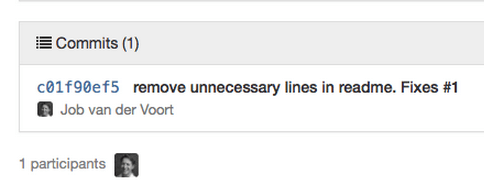

阮一峰网络日志：http://www.ruanyifeng.com/blog/2012/07/git.html

### 1、Git 工作流程

Git 作为一个源码管理系统，不可避免涉及到多人协作。

协作必须有一个规范的工作流程，让大家有效地合作，使得项目井井有条地发展下去。"工作流程"在英语里，叫做"workflow"或者"flow"，原意是水流，比喻项目像水流那样，顺畅、自然地向前流动，不会发生冲击、对撞、甚至漩涡。


本文介绍三种广泛使用的工作流程：

- Git flow
- Github flow
- Gitlab flow

如果你对Git还不是很熟悉，可以先阅读下面的文章。

- [《Git 使用规范流程》](http://www.ruanyifeng.com/blog/2015/08/git-use-process.html)
- [《常用 Git 命令清单》](http://www.ruanyifeng.com/blog/2015/12/git-cheat-sheet.html)
- [《Git 远程操作详解》](http://www.ruanyifeng.com/blog/2014/06/git_remote.html)

#### 一、功能驱动

本文的三种工作流程，有一个共同点：都采用["功能驱动式开发"](https://en.wikipedia.org/wiki/Feature-driven_development)（Feature-driven development，简称FDD）。

它指的是，需求是开发的起点，先有需求再有功能分支（feature branch）或者补丁分支（hotfix branch）。完成开发后，该分支就合并到主分支，然后被删除。

#### 二、Git flow

最早诞生、并得到广泛采用的一种工作流程，就是[Git flow](http://nvie.com/posts/a-successful-git-branching-model/) 。

##### 2.1 特点

它最主要的特点有两个。


首先，项目存在两个长期分支。

- 主分支master
- 开发分支develop

前者用于存放对外发布的版本，任何时候在这个分支拿到的，都是稳定的分布版；后者用于日常开发，存放最新的开发版。

其次，项目存在三种短期分支。

- 功能分支（feature     branch）
- 补丁分支（hotfix     branch）
- 预发分支（release     branch）

一旦完成开发，它们就会被合并进develop或master，然后被删除。

Git flow 的详细介绍，请阅读我翻译的中文版[《Git 分支管理策略》](http://www.ruanyifeng.com/blog/2012/07/git.html)。

##### 2.2 评价

Git flow的优点是清晰可控，缺点是相对复杂，需要同时维护两个长期分支。大多数工具都将master当作默认分支，可是开发是在develop分支进行的，这导致经常要切换分支，非常烦人。

更大问题在于，这个模式是基于"版本发布"的，目标是一段时间以后产出一个新版本。但是，很多网站项目是"持续发布"，代码一有变动，就部署一次。这时，master分支和develop分支的差别不大，没必要维护两个长期分支。

#### 三、Github flow

[Github flow](http://scottchacon.com/2011/08/31/github-flow.html) 是Git flow的简化版，专门配合"持续发布"。它是 Github.com 使用的工作流程。

##### 3.1 流程

它只有一个长期分支，就是master，因此用起来非常简单。

官方推荐的[流程](https://guides.github.com/introduction/flow/index.html)如下。


第一步：根据需求，从master拉出新分支，不区分功能分支或补丁分支。

第二步：新分支开发完成后，或者需要讨论的时候，就向master发起一个[pull request](https://help.github.com/articles/using-pull-requests/)（简称PR）。

第三步：Pull Request既是一个通知，让别人注意到你的请求，又是一种对话机制，大家一起评审和讨论你的代码。对话过程中，你还可以不断提交代码。

第四步：你的Pull Request被接受，合并进master，重新部署后，原来你拉出来的那个分支就被删除。（先部署再合并也可。）

##### 3.2 评价

Github flow 的最大优点就是简单，对于"持续发布"的产品，可以说是最合适的流程。

问题在于它的假设：master分支的更新与产品的发布是一致的。也就是说，master分支的最新代码，默认就是当前的线上代码。

可是，有些时候并非如此，代码合并进入master分支，并不代表它就能立刻发布。比如，苹果商店的APP提交审核以后，等一段时间才能上架。这时，如果还有新的代码提交，master分支就会与刚发布的版本不一致。另一个例子是，有些公司有发布窗口，只有指定时间才能发布，这也会导致线上版本落后于master分支。

上面这种情况，只有master一个主分支就不够用了。通常，你不得不在master分支以外，另外新建一个production分支跟踪线上版本。

#### 四、Gitlab flow

[Gitlab flow](http://doc.gitlab.com/ee/workflow/gitlab_flow.html) 是 Git flow 与 Github flow 的综合。它吸取了两者的优点，既有适应不同开发环境的弹性，又有单一主分支的简单和便利。它是 Gitlab.com 推荐的做法。

##### 4.1 上游优先

Gitlab flow 的最大原则叫做"上游优先"（upsteam first），即只存在一个主分支master，它是所有其他分支的"上游"。只有上游分支采纳的代码变化，才能应用到其他分支。

[Chromium项目](https://www.chromium.org/chromium-os/chromiumos-design-docs/upstream-first)就是一个例子，它明确规定，上游分支依次为：

1. Linus Torvalds的分支
2. 子系统（比如netdev）的分支
3. 设备厂商（比如三星）的分支

##### 4.2 持续发布

Gitlab flow 分成两种情况，适应不同的开发流程。


对于"持续发布"的项目，它建议在master分支以外，再建立不同的环境分支。比如，"开发环境"的分支是master，"预发环境"的分支是pre-production，"生产环境"的分支是production。

开发分支是预发分支的"上游"，预发分支又是生产分支的"上游"。代码的变化，必须由"上游"向"下游"发展。比如，生产环境出现了bug，这时就要新建一个功能分支，先把它合并到master，确认没有问题，再cherry-pick到pre-production，这一步也没有问题，才进入production。

只有紧急情况，才允许跳过上游，直接合并到下游分支。

##### 4.3 版本发布


对于"版本发布"的项目，建议的做法是每一个稳定版本，都要从master分支拉出一个分支，比如2-3-stable、2-4-stable等等。

以后，只有修补bug，才允许将代码合并到这些分支，并且此时要更新小版本号。

#### 五、一些小技巧

##### 5.1 Pull Request


功能分支合并进master分支，必须通过Pull Request（Gitlab里面叫做 Merge Request）。


前面说过，Pull Request本质是一种对话机制，你可以在提交的时候，@相关[人员](https://github.com/blog/1004-mention-autocompletion)或[团队](https://github.com/blog/1121-introducing-team-mentions)，引起他们的注意。

##### 5.2 Protected branch

master分支应该受到保护，不是每个人都可以修改这个分支，以及拥有审批 Pull Request 的权力。

[Github](https://help.github.com/articles/about-protected-branches/) 和 [Gitlab](http://doc.gitlab.com/ce/permissions/permissions.html) 都提供"保护分支"（Protected branch）这个功能。

##### 5.3 Issue

Issue 用于 Bug追踪和需求管理。建议先新建 Issue，再新建对应的功能分支。功能分支总是为了解决一个或多个 Issue。

功能分支的名称，可以与issue的名字保持一致，并且以issue的编号起首，比如"15-require-a-password-to-change-it"。



开发完成后，在提交说明里面，可以写上"fixes #14"或者"closes #67"。Github规定，只要commit message里面有下面这些[动词](https://help.github.com/articles/closing-issues-via-commit-messages/) + 编号，就会关闭对应的issue。

- close
- closes
- closed
- fix
- fixes
- fixed
- resolve
- resolves
- resolved

这种方式还可以一次关闭多个issue，或者关闭其他代码库的issue，格式是username/repository#issue_number。

Pull Request被接受以后，issue关闭，原始分支就应该删除。如果以后该issue重新打开，新分支可以复用原来的名字。

##### 5.4 Merge节点

Git有两种合并：一种是"直进式合并"（fast forward），不生成单独的合并节点；另一种是"非直进式合并"（none fast-forword），会生成单独节点。

前者不利于保持commit信息的清晰，也不利于以后的回滚，建议总是采用后者（即使用--no-ff参数）。只要发生合并，就要有一个单独的合并节点。

##### 5.5 Squash 多个commit

为了便于他人阅读你的提交，也便于cherry-pick或撤销代码变化，在发起Pull Request之前，应该把多个commit合并成一个。（前提是，该分支只有你一个人开发，且没有跟master合并过。）


这可以采用rebase命令附带的squash操作，具体方法请参考我写的[《Git 使用规范流程》](http://www.ruanyifeng.com/blog/2015/08/git-use-process.html)。

 

 

### 2、Git分支管理策略

如果你严肃对待编程，就必定会使用"[版本管理系统](http://www.ruanyifeng.com/blog/2008/12/a_visual_guide_to_version_control.html)"（Version Control System）。

眼下最流行的"版本管理系统"，非[Git](http://git-scm.com/)莫属。


相比同类软件，Git有很多优点。其中很显著的一点，就是版本的分支（branch）和合并（merge）十分方便。有些传统的版本管理软件，分支操作实际上会生成一份现有代码的物理拷贝，而Git只生成一个指向当前版本（又称"快照"）的指针，因此非常快捷易用。

但是，太方便了也会产生副作用。如果你不加注意，很可能会留下一个枝节蔓生、四处开放的版本库，到处都是分支，完全看不出主干发展的脉络。


[Vincent Driessen](http://nvie.com/)提出了一个分支管理的[策略](http://nvie.com/posts/a-successful-git-branching-model/)，我觉得非常值得借鉴。它可以使得版本库的演进保持简洁，主干清晰，各个分支各司其职、井井有条。理论上，这些策略对所有的版本管理系统都适用，Git只是用来举例而已。如果你不熟悉Git，跳过举例部分就可以了。

**一、主分支Master**

首先，代码库应该有一个、且仅有一个主分支。所有提供给用户使用的正式版本，都在这个主分支上发布。


Git主分支的名字，默认叫做Master。它是自动建立的，版本库初始化以后，默认就是在主分支在进行开发。

**二、开发分支Develop**

主分支只用来分布重大版本，日常开发应该在另一条分支上完成。我们把开发用的分支，叫做Develop。


这个分支可以用来生成代码的最新隔夜版本（nightly）。如果想正式对外发布，就在Master分支上，对Develop分支进行"合并"（merge）。

Git创建Develop分支的命令：

```
git checkout -b develop master
```

将Develop分支发布到Master分支的命令：

　　### 切换到Master分支
```
git checkout master
```


　　### 对Develop分支进行合并
```
git merge --no-ff develop
```

这里稍微解释一下，上一条命令的--no-ff参数是什么意思。默认情况下，Git执行"快进式合并"（fast-farward merge），会直接将Master分支指向Develop分支。


使用--no-ff参数后，会执行正常合并，在Master分支上生成一个新节点。为了保证版本演进的清晰，我们希望采用这种做法。关于合并的更多解释，请参考Benjamin Sandofsky的[《Understanding the Git Workflow》](http://sandofsky.com/blog/git-workflow.html)。


**三、临时性分支**

前面讲到版本库的两条主要分支：Master和Develop。前者用于正式发布，后者用于日常开发。其实，常设分支只需要这两条就够了，不需要其他了。

但是，除了常设分支以外，还有一些临时性分支，用于应对一些特定目的的版本开发。临时性分支主要有三种：

　　* 功能（feature）分支

　　* 预发布（release）分支

　　* 修补bug（fixbug）分支

这三种分支都属于临时性需要，使用完以后，应该删除，使得代码库的常设分支始终只有Master和Develop。

**四、 功能分支**

接下来，一个个来看这三种"临时性分支"。

第一种是功能分支，它是为了开发某种特定功能，从Develop分支上面分出来的。开发完成后，要再并入Develop。


功能分支的名字，可以采用feature-*的形式命名。

创建一个功能分支：

```
git checkout -b feature-x develop
```

开发完成后，将功能分支合并到develop分支：

```
git checkout develop

git merge --no-ff feature-x
```

删除feature分支：

```
git branch -d feature-x
```

**五、预发布分支**

第二种是预发布分支，它是指发布正式版本之前（即合并到Master分支之前），我们可能需要有一个预发布的版本进行测试。

预发布分支是从Develop分支上面分出来的，预发布结束以后，必须合并进Develop和Master分支。它的命名，可以采用release-*的形式。

创建一个预发布分支：

```
git checkout -b release-1.2 develop
```

确认没有问题后，合并到master分支：

```
git checkout master

git merge --no-ff release-1.2
```


对合并生成的新节点，做一个标签

```
 git tag -a 1.2
```

再合并到develop分支：

```
git checkout develop

git merge --no-ff release-1.2
```

最后，删除预发布分支：

```
git branch -d release-1.2
```

**六、修补bug分支**

最后一种是修补bug分支。软件正式发布以后，难免会出现bug。这时就需要创建一个分支，进行bug修补。

修补bug分支是从Master分支上面分出来的。修补结束以后，再合并进Master和Develop分支。它的命名，可以采用fixbug-*的形式。


创建一个修补bug分支：

```
git checkout -b fixbug-0.1 master
```

修补结束后，合并到master分支：

```
git checkout master

git merge --no-ff fixbug-0.1

git tag -a 0.1.1
```

再合并到develop分支：

```
git checkout develop

git merge --no-ff fixbug-0.1
```

最后，删除"修补bug分支"：

```
git branch -d fixbug-0.1
```

 

 

 

### 3、常用 Git 命令清单

我每天使用 Git ，但是很多命令记不住。

一般来说，日常使用只要记住下图6个命令，就可以了。但是熟练使用，恐怕要记住60～100个命令。


下面是我整理的常用 Git 命令清单。几个专用名词的译名如下。

- Workspace：工作区
- Index / Stage：暂存区
- Repository：仓库区（或本地仓库）
- Remote：远程仓库

#### 一、新建代码库

在当前目录新建一个Git代码库

```
git init
```

新建一个目录，将其初始化为Git代码库

```
git init [project-name]
```

下载一个项目和它的整个代码历史

```
git clone [url]
```

#### 二、配置

Git的设置文件为.gitconfig，它可以在用户主目录下（全局配置），也可以在项目目录下（项目配置）。

显示当前的Git配置

```
git config --list
```

编辑Git配置文件

```
git config -e [--global]
```

 

设置提交代码时的用户信息

```
git config [--global] user.name "[name]"

git config [--global] user.email "[email address]"
```

#### 三、增加/删除文件

添加指定文件到暂存区

```
git add [file1] [file2] ...
```

 

添加指定目录到暂存区，包括子目录

```
git add [dir]
```

 

添加当前目录的所有文件到暂存区

```
git add .
```

 

添加每个变化前，都会要求确认

对于同一个文件的多处变化，可以实现分次提交

```
git add -p
```

 

删除工作区文件，并且将这次删除放入暂存区

```
git rm [file1] [file2] ...
```

 

停止追踪指定文件，但该文件会保留在工作区

```
git rm --cached [file]
```

 

改名文件，并且将这个改名放入暂存区

```
git mv [file-original] [file-renamed]
```

#### 四、代码提交

提交暂存区到仓库区

```
git commit -m [message]
```

 

提交暂存区的指定文件到仓库区

```
git commit [file1] [file2] ... -m [message]
```

 

提交工作区自上次commit之后的变化，直接到仓库区

```
git commit -a
```

 

提交时显示所有diff信息

```
git commit -v
```

 

使用一次新的commit，替代上一次提交

如果代码没有任何新变化，则用来改写上一次commit的提交信息

```
git commit --amend -m [message]
```

 

重做上一次commit，并包括指定文件的新变化

```
git commit --amend [file1] [file2] ...
```

#### 五、分支

列出所有本地分支

```
git branch
```

 

列出所有远程分支

```
git branch -r
```

 

列出所有本地分支和远程分支

```
git branch -a
```

 

新建一个分支，但依然停留在当前分支

```
git branch [branch-name]
```

 

新建一个分支，并切换到该分支

```
git checkout -b [branch]
```

 

新建一个分支，指向指定commit

```
git branch [branch] [commit]
```

 

新建一个分支，与指定的远程分支建立追踪关系

```
git branch --track [branch] [remote-branch]
```

 

切换到指定分支，并更新工作区

```
git checkout [branch-name]
```

 

切换到上一个分支

```
git checkout -
```

 

建立追踪关系，在现有分支与指定的远程分支之间

```
git branch --set-upstream [branch] [remote-branch]
```

 

合并指定分支到当前分支

```
git merge [branch]
```

 

选择一个commit，合并进当前分支

```
git cherry-pick [commit]
```

 

删除分支

```
git branch -d [branch-name]
```

 

删除远程分支

```
git push origin --delete [branch-name]

git branch -dr [remote/branch]
```

#### 六、标签

列出所有tag

```
git tag
```

 

新建一个tag在当前commit

```
git tag [tag]
```

 

新建一个tag在指定commit

```
git tag [tag] [commit]
```

 

删除本地tag

```
git tag -d [tag]
```

 

删除远程tag

```
git push origin :refs/tags/[tagName]
```

 

查看tag信息

```
git show [tag]
```

 

提交指定tag

```
git push [remote] [tag]
```

 

提交所有tag

```
git push [remote] --tags
```

 

新建一个分支，指向某个tag

```
git checkout -b [branch] [tag]
```

#### 七、查看信息

显示有变更的文件

```
git status
```

 

显示当前分支的版本历史

```
git log
```

 

显示commit历史，以及每次commit发生变更的文件

```
git log --stat
```

 

搜索提交历史，根据关键词

```
git log -S [keyword]
```

 

显示某个commit之后的所有变动，每个commit占据一行

```
git log [tag] HEAD --pretty=format:%s
```

 

显示某个commit之后的所有变动，其"提交说明"必须符合搜索条件

```
git log [tag] HEAD --grep feature
```

 

显示某个文件的版本历史，包括文件改名

```
git log --follow [file]

git whatchanged [file]
```

 

显示指定文件相关的每一次diff

```
git log -p [file]
```

 

显示过去5次提交

```
git log -5 --pretty --oneline
```

 

显示所有提交过的用户，按提交次数排序

```
git shortlog -sn
```

 

显示指定文件是什么人在什么时间修改过

```
git blame [file]
```

 

显示暂存区和工作区的差异

```
git diff
```

 

显示暂存区和上一个commit的差异

```
git diff --cached [file]
```

 

显示工作区与当前分支最新commit之间的差异

```
git diff HEAD
```

 

显示两次提交之间的差异

```
git diff [first-branch]...[second-branch]
```

 

显示今天你写了多少行代码

```
git diff --shortstat "@{0 day ago}"
```

 

显示某次提交的元数据和内容变化

```
git show [commit]
```

 

显示某次提交发生变化的文件

```
git show --name-only [commit]
```

 

显示某次提交时，某个文件的内容

```
git show [commit]:[filename]
```

 

显示当前分支的最近几次提交

```
git reflog
```

#### 八、远程同步

下载远程仓库的所有变动

```
git fetch [remote]
```

 

显示所有远程仓库

```
git remote -v
```

 

显示某个远程仓库的信息

```
git remote show [remote]
```

 

增加一个新的远程仓库，并命名

```
git remote add [shortname] [url]
```

 

取回远程仓库的变化，并与本地分支合并

```
git pull [remote] [branch]
```

 

上传本地指定分支到远程仓库

```
git push [remote] [branch]
```

 

强行推送当前分支到远程仓库，即使有冲突

```
git push [remote] --force
```

 

推送所有分支到远程仓库

```
git push [remote] --all
```

#### 九、撤销

恢复暂存区的指定文件到工作区

```
git checkout [file]
```

 

恢复某个commit的指定文件到暂存区和工作区

```
git checkout [commit] [file]
```

 

恢复暂存区的所有文件到工作区

```
git checkout .
```

 

重置暂存区的指定文件，与上一次commit保持一致，但工作区不变

```
git reset [file]
```

 

重置暂存区与工作区，与上一次commit保持一致

```
git reset --hard
```

 

重置当前分支的指针为指定commit，同时重置暂存区，但工作区不变

```
git reset [commit]
```

 

重置当前分支的HEAD为指定commit，同时重置暂存区和工作区，与指定commit一致

```
git reset --hard [commit]
```

 

重置当前HEAD为指定commit，但保持暂存区和工作区不变

```
git reset --keep [commit]
```

 

新建一个commit，用来撤销指定commit

后者的所有变化都将被前者抵消，并且应用到当前分支

```
git revert [commit]
```

 

暂时将未提交的变化移除，稍后再移入

```
git stash

git stash pop
```

#### 十、其他

生成一个可供发布的压缩包

```
git archive
```

 

### 4、Git 使用规范流程

团队开发中，遵循一个合理、清晰的Git使用流程，是非常重要的。

否则，每个人都提交一堆杂乱无章的commit，项目很快就会变得难以协调和维护。

下面是[ThoughtBot](https://github.com/thoughtbot/guides/tree/master/protocol/git) 的Git使用规范流程。我从中学到了很多，推荐你也这样使用Git。


第一步：新建分支

首先，每次开发新功能，都应该新建一个单独的分支（这方面可以参考[《Git分支管理策略》](http://www.ruanyifeng.com/blog/2012/07/git.html)）。

 

获取主干最新代码

```
git checkout master

git pull
```

 

新建一个开发分支myfeature

```
git checkout -b myfeature
```

第二步：提交分支commit

分支修改后，就可以提交commit了。 

```
git add --all

git status

git commit --verbose
```

git add 命令的all参数，表示保存所有变化（包括新建、修改和删除）。从Git 2.0开始，all是 git add 的默认参数，所以也可以用 git add . 代替。

git status 命令，用来查看发生变动的文件。

git commit 命令的verbose参数，会列出 [diff](http://www.ruanyifeng.com/blog/2012/08/how_to_read_diff.html) 的结果。

第三步：撰写提交信息

提交commit时，必须给出完整扼要的提交信息，下面是一个范本。

```
Present-tense summary under 50 characters

* More information about commit (under 72 characters).

* More information about commit (under 72 characters).

http://project.management-system.com/ticket/123
```

第一行是不超过50个字的提要，然后空一行，罗列出改动原因、主要变动、以及需要注意的问题。最后，提供对应的网址（比如Bug ticket）。

第四步：与主干同步

分支的开发过程中，要经常与主干保持同步。

```
git fetch origin

git rebase origin/master
```

第五步：合并commit

分支开发完成后，很可能有一堆commit，但是合并到主干的时候，往往希望只有一个（或最多两三个）commit，这样不仅清晰，也容易管理。

那么，怎样才能将多个commit合并呢？这就要用到 git rebase 命令。

```
git rebase -i origin/master
```

git rebase命令的i参数表示互动（interactive），这时git会打开一个互动界面，进行下一步操作。

下面采用[Tute Costa](https://robots.thoughtbot.com/git-interactive-rebase-squash-amend-rewriting-history)的例子，来解释怎么合并commit。

```
pick 07c5abd Introduce OpenPGP and teach basic usage

pick de9b1eb Fix PostChecker::Post#urls

pick 3e7ee36 Hey kids, stop all the highlighting

pick fa20af3 git interactive rebase, squash, amend

 

Rebase 8db7e8b..fa20af3 onto 8db7e8b

\#

Commands:

p, pick = use commit

r, reword = use commit, but edit the commit message

e, edit = use commit, but stop for amending

s, squash = use commit, but meld into previous commit

f, fixup = like "squash", but discard this commit's log message

x, exec = run command (the rest of the line) using shell

\#

These lines can be re-ordered; they are executed from top to bottom.

\#

If you remove a line here THAT COMMIT WILL BE LOST.

\#

However, if you remove everything, the rebase will be aborted.

\#

Note that empty commits are commented out
```

上面的互动界面，先列出当前分支最新的4个commit（越下面越新）。每个commit前面有一个操作命令，默认是pick，表示该行commit被选中，要进行rebase操作。

4个commit的下面是一大堆注释，列出可以使用的命令。

- pick：正常选中
- reword：选中，并且修改提交信息；
- edit：选中，rebase时会暂停，允许你修改这个commit（参考[这里](https://schacon.github.io/gitbook/4_interactive_rebasing.html)）
- squash：选中，会将当前commit与上一个commit合并
- fixup：与squash相同，但不会保存当前commit的提交信息
- exec：执行其他shell命令

上面这6个命令当中，squash和fixup可以用来合并commit。先把需要合并的commit前面的动词，改成squash（或者s）。

 

pick 07c5abd Introduce OpenPGP and teach basic usage

s de9b1eb Fix PostChecker::Post#urls

s 3e7ee36 Hey kids, stop all the highlighting

pick fa20af3 git interactive rebase, squash, amend

这样一改，执行后，当前分支只会剩下两个commit。第二行和第三行的commit，都会合并到第一行的commit。提交信息会同时包含，这三个commit的提交信息。

```
This is a combination of 3 commits.

The first commit's message is:

Introduce OpenPGP and teach basic usage

 

This is the 2nd commit message:

Fix PostChecker::Post#urls

 

This is the 3rd commit message:

Hey kids, stop all the highlighting

如果将第三行的squash命令改成fixup命令。

 

pick 07c5abd Introduce OpenPGP and teach basic usage

s de9b1eb Fix PostChecker::Post#urls

f 3e7ee36 Hey kids, stop all the highlighting

pick fa20af3 git interactive rebase, squash, amend
```

运行结果相同，还是会生成两个commit，第二行和第三行的commit，都合并到第一行的commit。但是，新的提交信息里面，第三行commit的提交信息，会被注释掉。

```
This is a combination of 3 commits.

The first commit's message is:

Introduce OpenPGP and teach basic usage

 

This is the 2nd commit message:

Fix PostChecker::Post#urls

 

This is the 3rd commit message:

Hey kids, stop all the highlighting
```

[Pony Foo](http://ponyfoo.com/articles/git-github-hacks)提出另外一种合并commit的简便方法，就是先撤销过去5个commit，然后再建一个新的。

```
git reset HEAD~5

git add .

git commit -am "Here's the bug fix that closes #28"

git push --force

squash和fixup命令，还可以当作命令行参数使用，自动合并commit。

 

git commit --fixup 

git rebase -i --autosquash 
```

这个用法请参考[这篇文章](http://fle.github.io/git-tip-keep-your-branch-clean-with-fixup-and-autosquash.html)，这里就不解释了。

#### 第六步：推送到远程仓库

合并commit后，就可以推送当前分支到远程仓库了。

```
git push --force origin myfeature
```

git push命令要加上force参数，因为rebase以后，分支历史改变了，跟远程分支不一定兼容，有可能要强行推送（参见[这里](http://willi.am/blog/2014/08/12/the-dark-side-of-the-force-push/)）。

#### 第七步：发出Pull Request

提交到远程仓库以后，就可以发出 Pull Request 到master分支，然后请求别人进行代码review，确认可以合并到master。

 

### 5、Git远程操作详解

[Git](http://zh.wikipedia.org/wiki/Git)是目前最流行的[版本管理系统](http://www.ruanyifeng.com/blog/2008/12/a_visual_guide_to_version_control.html)，学会Git几乎成了开发者的必备技能。

Git有很多优势，其中之一就是远程操作非常简便。本文详细介绍5个Git命令，它们的概念和用法，理解了这些内容，你就会完全掌握Git远程操作。

- git clone
- git remote
- git fetch
- git pull
- git push

本文针对初级用户，从最简单的讲起，但是需要读者对Git的基本用法有所了解。同时，本文覆盖了上面5个命令的几乎所有的常用用法，所以对于熟练用户也有参考价值。


#### 一、git clone

远程操作的第一步，通常是从远程主机克隆一个版本库，这时就要用到git clone命令。

```
git clone <版本库的网址>
```

比如，克隆jQuery的版本库。

```
git clone https://github.com/jquery/jquery.git
```

该命令会在本地主机生成一个目录，与远程主机的版本库同名。如果要指定不同的目录名，可以将目录名作为git clone命令的第二个参数。

```
git clone <版本库的网址><本地目录名>
```

git clone支持多种协议，除了HTTP(s)以外，还支持SSH、Git、本地文件协议等，下面是一些例子。

```
git clone http[s]://example.com/path/to/repo.git/

git clone ssh://example.com/path/to/repo.git/

git clone git://example.com/path/to/repo.git/

git clone /opt/git/project.git 

git clone file:///opt/git/project.git

git clone ftp[s]://example.com/path/to/repo.git/

git clone rsync://example.com/path/to/repo.git/
```

SSH协议还有另一种写法。

```
git clone [user@]example.com:path/to/repo.git/
```

通常来说，Git协议下载速度最快，SSH协议用于需要用户认证的场合。各种协议优劣的详细讨论请参考[官方文档](http://git-scm.com/book/en/Git-on-the-Server-The-Protocols)。

#### 二、git remote

为了便于管理，Git要求每个远程主机都必须指定一个主机名。git remote命令就用于管理主机名。

不带选项的时候，git remote命令列出所有远程主机。 

```
git remote

origin
```

使用-v选项，可以参看远程主机的网址。

```
git remote -v

origin [git@github](mailto:git@github).com:jquery/jquery.git (fetch)

origin [git@github](mailto:git@github).com:jquery/jquery.git (push)
```

上面命令表示，当前只有一台远程主机，叫做origin，以及它的网址。

克隆版本库的时候，所使用的远程主机自动被Git命名为origin。如果想用其他的主机名，需要用git clone命令的-o选项指定。

```
git clone -o jQuery https://github.com/jquery/jquery.git

git remote

jQuery
```

上面命令表示，克隆的时候，指定远程主机叫做jQuery。

```
git remote show命令加上主机名，可以查看该主机的详细信息。


git remote show <主机名>
git remote add命令用于添加远程主机。
 

git remote add <主机名><网址>
git remote rm命令用于删除远程主机。


git remote rm <主机名>
git remote rename命令用于远程主机的改名。


git remote rename <原主机名><新主机名>
```

#### 三、git fetch

一旦远程主机的版本库有了更新（Git术语叫做commit），需要将这些更新取回本地，这时就要用到git fetch命令。

```
git fetch <远程主机名>
```

上面命令将某个远程主机的更新，全部取回本地。

git fetch命令通常用来查看其他人的进程，因为它取回的代码对你本地的开发代码没有影响。

默认情况下，git fetch取回所有分支（branch）的更新。如果只想取回特定分支的更新，可以指定分支名。

```
git fetch <远程主机名><分支名>
```

比如，取回origin主机的master分支。

```
git fetch origin master
```

所取回的更新，在本地主机上要用"远程主机名/分支名"的形式读取。比如origin主机的master，就要用origin/master读取。

git branch命令的-r选项，可以用来查看远程分支，-a选项查看所有分支。

```
git branch -r

origin/master


git branch -a

*master

remotes/origin/master
```

上面命令表示，本地主机的当前分支是master，远程分支是origin/master。

取回远程主机的更新以后，可以在它的基础上，使用git checkout命令创建一个新的分支。

```
git checkout -b newBrach origin/master
```

上面命令表示，在origin/master的基础上，创建一个新分支。

此外，也可以使用git merge命令或者git rebase命令，在本地分支上合并远程分支。

```
git merge origin/master
```

或者

```
git rebase origin/master
```

上面命令表示在当前分支上，合并origin/master。

#### 四、git pull

git pull命令的作用是，取回远程主机某个分支的更新，再与本地的指定分支合并。它的完整格式稍稍有点复杂。

```
git pull <远程主机名><远程分支名>:<本地分支名>
```

比如，取回origin主机的next分支，与本地的master分支合并，需要写成下面这样。

```
git pull origin next:master
```

如果远程分支是与当前分支合并，则冒号后面的部分可以省略。

```
git pull origin next
```

上面命令表示，取回origin/next分支，再与当前分支合并。实质上，这等同于先做git fetch，再做git merge。 

```
git fetch origin

git merge origin/next
```

在某些场合，Git会自动在本地分支与远程分支之间，建立一种追踪关系（tracking）。比如，在git clone的时候，所有本地分支默认与远程主机的同名分支，建立追踪关系，也就是说，本地的master分支自动"追踪"origin/master分支。

Git也允许手动建立追踪关系。

```
git branch --set-upstream master origin/next
```

上面命令指定master分支追踪origin/next分支。

如果当前分支与远程分支存在追踪关系，git pull就可以省略远程分支名。

```
git pull origin
```

上面命令表示，本地的当前分支自动与对应的origin主机"追踪分支"（remote-tracking branch）进行合并。

如果当前分支只有一个追踪分支，连远程主机名都可以省略。

```
git pull
```

上面命令表示，当前分支自动与唯一一个追踪分支进行合并。

如果合并需要采用rebase模式，可以使用--rebase选项。

```
git pull --rebase <远程主机名><远程分支名>:<本地分支名>
```

如果远程主机删除了某个分支，默认情况下，git pull 不会在拉取远程分支的时候，删除对应的本地分支。这是为了防止，由于其他人操作了远程主机，导致git pull不知不觉删除了本地分支。

但是，你可以改变这个行为，加上参数 -p 就会在本地删除远程已经删除的分支。

```
git pull -p
```

等同于下面的命令

```
git fetch --prune origin 

git fetch -p
```


#### 五、git push

git push命令用于将本地分支的更新，推送到远程主机。它的格式与git pull命令相仿。

```
git push <远程主机名><本地分支名>:<远程分支名>
```

注意，分支推送顺序的写法是<来源地>:<目的地>，所以git pull是<远程分支>:<本地分支>，而git push是<本地分支>:<远程分支>。

如果省略远程分支名，则表示将本地分支推送与之存在"追踪关系"的远程分支（通常两者同名），如果该远程分支不存在，则会被新建。

```
git push origin master
```

上面命令表示，将本地的master分支推送到origin主机的master分支。如果后者不存在，则会被新建。

如果省略本地分支名，则表示删除指定的远程分支，因为这等同于推送一个空的本地分支到远程分支。

```
git push origin :master
```

等同于

```
git push origin --delete master
```

上面命令表示删除origin主机的master分支。

如果当前分支与远程分支之间存在追踪关系，则本地分支和远程分支都可以省略。

```
git push origin
```

上面命令表示，将当前分支推送到origin主机的对应分支。

如果当前分支只有一个追踪分支，那么主机名都可以省略。

```
git push
```

如果当前分支与多个主机存在追踪关系，则可以使用-u选项指定一个默认主机，这样后面就可以不加任何参数使用git push。

```
git push -u origin master
```

上面命令将本地的master分支推送到origin主机，同时指定origin为默认主机，后面就可以不加任何参数使用git push了。

不带任何参数的git push，默认只推送当前分支，这叫做simple方式。此外，还有一种matching方式，会推送所有有对应的远程分支的本地分支。Git 2.0版本之前，默认采用matching方法，现在改为默认采用simple方式。如果要修改这个设置，可以采用git config命令。

```
git config --global push.default matching
```

或者

```
git config --global push.default simple
```

还有一种情况，就是不管是否存在对应的远程分支，将本地的所有分支都推送到远程主机，这时需要使用--all选项。

```
git push --all origin
```

上面命令表示，将所有本地分支都推送到origin主机。

如果远程主机的版本比本地版本更新，推送时Git会报错，要求先在本地做git pull合并差异，然后再推送到远程主机。这时，如果你一定要推送，可以使用--force选项。 

```
git push --force origin 
```

上面命令使用--force选项，结果导致远程主机上更新的版本被覆盖。除非你很确定要这样做，否则应该尽量避免使用--force选项。

最后，git push不会推送标签（tag），除非使用--tags选项。

```
git push origin --tags
```

 